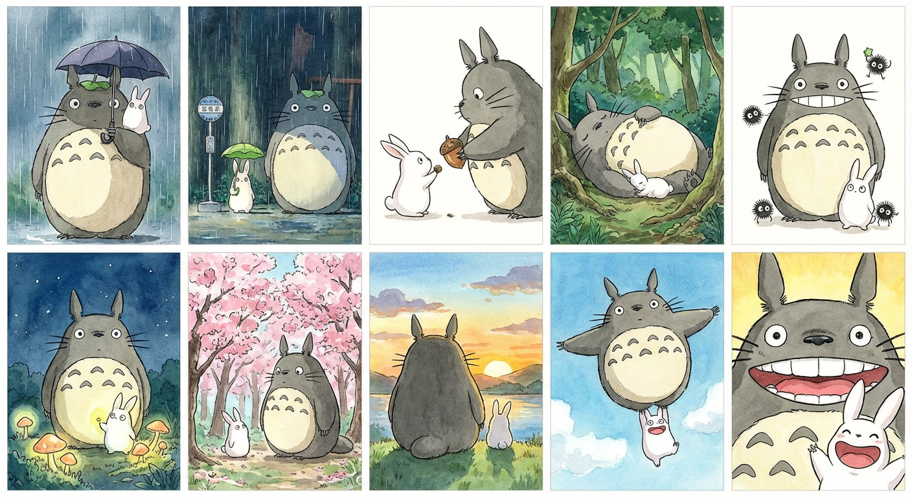
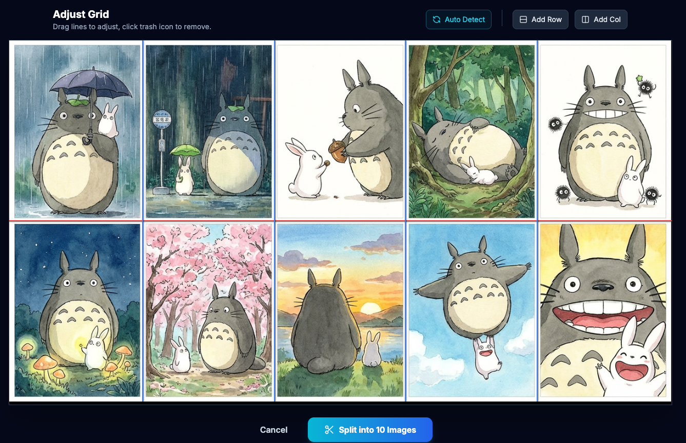
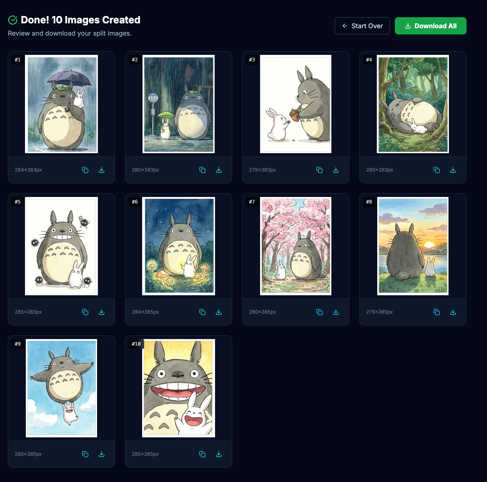

# 随手写了个小工具，解决了 Nano Banana Pro 的切图麻烦 🍌

> 最近沉迷 Google Nano Banana Pro 生图，质量确实顶。但每次生成出来的 Grid 九宫格，想拿其中一张做垫图时，都要开 PS（或者其他编辑工具）切割，实在有点断节奏。
>
> 作为一个“能用代码解决就不动手”的懒人，我花了一点时间，和 AI 一起写了个网页小工具。没想到，用起来还真挺顺手的。

---

## 🤔 一个微小的痛点

玩 AI 绘画的朋友应该都有体会：无论是 Midjourney 还是现在的 Nano Banana Pro，为了加快速度（同时节省 token ），默认都会先给一张 2x2 或 3x3 的 **Grid 预览图**。

有时候我并不想等待官方的 Upscale，或者我想把这 9 张图全部存下来，作为下一轮生成的 Reference（参考图）。

以前我的做法是：
1. 截图（容易歪，有损）
2. 打开 PS -> 导入 -> 裁剪 -> 导出（太繁琐）
3. 忍着不切（强迫症难受）

当然，你也可以“口述”，要求 ai 处理其中的第3张图（或者左下角那张），但 ai 不一定能准确理解，如果选错了，再多对话几轮，一致性就很难保证了。

虽然这只是个很小的问题，但每次重复处理，还是挺磨人的。

---

## ⚡️ Vibe Coding：说干就干

要是放在以前，为了这么个小需求专门写个软件，可能得不偿失。但现在不一样了，我们有 **Vibe Coding**。

我把我的想法告诉了 AI：
> "我想做一个网页，能上传长图或九宫格图，自动识别中间的空隙，把它们切成独立的小图。最好支持直接粘贴，切完能直接复制。"

然后，我们就开始“结对编程”了。
- 它负责写算法识别像素间隙；
- 我负责调整交互体验（比如那个把删除按钮移到两端的小细节）；
- 它负责优化 CSS 样式；
- 我负责测试各种奇怪的 Grid 图...

没过多久，[**SplitStitch**](https://songofhawk.github.io/split-image/) 就诞生了。

---

## 🛠️ 它能干什么？

这个工具的功能非常简单，就是**专一地解决“切图”这一件事**。

### 1. 自动识别 Grid

你把 Banana Pro 生成的九宫格（或者任何拼接图）拖进去，或者直接 `Ctrl+V` 粘贴。它会自动分析图片里的间隙，生成分割线。

*▲ 就像这张测试用的拼接图，红线就是自动识别出来的*

### 2. 闭环工作流

为了不打断生图的“心流”，我特意加了剪贴板支持：
- 在 Banana Pro 复制图片 -> 在工具里粘贴
- 切割完 -> 点击小图复制 -> 粘贴回 Banana Pro 做垫图

全程不需要打开文件夹，也不用保存临时文件。

*▲ 切割完，点一下复制，就能拿去用了*

---

## Vibe Coding：工具的未来

写这篇文章，其实不光是想分享这个小工具（虽然它确实挺好用的，欢迎大家免费白嫖）。

我更想分享的是一种**新的可能性**。

SplitStitch 只是一个很小的工具，它可能无法成为一个独角兽产品，甚至可能只服务于一小群有特定需求的人。但在 Vibe Coding 的时代，这都不重要。

**重要的是，当你有了一个想法，或者遇到了一个痛点，你不再需要忍受，也不需要等待大公司来拯救你。你可以通过 AI，亲手打造一把最趁手的“瑞士军刀”。**

- 也许你是会计，想写个脚本自动核对特定的发票；
- 也许你是老师，想做个小网页自动生成教案格式；
- 也许你只是个爱玩游戏的，想做个计算器算装备收益...

**Vibe Coding 将会带来前所未有的工具丰富度。** 未来的软件世界，不再只是几个超级 App 的天下，而是会有无数个像 SplitStitch 这样的小工具，由每一个像你我这样的普通人创造，去温暖每一个细小的需求。

---

### 🔗 试用地址

工具完全免费，所有图片处理都在你的浏览器本地完成，安全放心。

[点击这里体验 SplitStitch](https://songofhawk.github.io/split-image/)

如果你也觉得好用，或者有新的想法，欢迎在评论区告诉我。也许下一版更新，就是我和你（以及 AI）一起完成的呢？�

---

本文工具开源免费 | Made with Vibe Coding 
示例图片来源：宫崎骏《龙猫》

